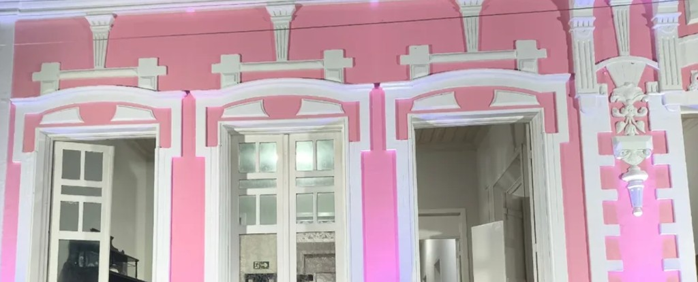

# Design System — Museu (HeroUI)

Sistema visual inspirado na fachada do prédio do museu: **rosa vibrante** nas paredes, **branco ornamental** nos moldes e pilastras, e **magenta** da iluminação noturna como acento. Tipografia de títulos em **Bebas Neue**; corpo de texto na sans-serif padrão do HeroUI.

---

## 1. Referência visual



| Elemento arquitetônico | Uso na UI |
|------------------------|-----------|
| Paredes rosa | Cor primária, CTAs, destaques |
| Molduras brancas | Superfícies, cards, bordas |
| Pilastras verticais | Ritmo tipográfico Bebas (títulos altos) |
| Vitrais / sombras internas | Fundo do tema escuro |
| Luz magenta | Acento secundário, estados info/hover |

---

## 2. Paleta extraída e tokens de marca

Valores calibrados a partir da fotografia da fachada, ajustados para contraste acessível em UI (WCAG AA).

### 2.1 Cores de marca (fixas)

| Token | Hex | Uso |
|-------|-----|-----|
| `--brand-pink-50` | `#FDF2F6` | Fundo suave, badges |
| `--brand-pink-100` | `#FAD9E6` | Hover leve, seleção |
| `--brand-pink-200` | `#F5A8C0` | Bordas ativas |
| `--brand-pink-300` | `#ED7BA3` | — |
| `--brand-pink-400` | `#E9729B` | **Rosa fachada (principal)** |
| `--brand-pink-500` | `#D85A82` | Primary default |
| `--brand-pink-600` | `#C0456E` | Primary hover / pressed |
| `--brand-pink-700` | `#9E3658` | Texto sobre fundo claro |
| `--brand-pink-800` | `#7A2844` | — |
| `--brand-pink-900` | `#521A2E` | — |
| `--brand-white` | `#FFFFFF` | Molduras, cards |
| `--brand-cream` | `#F8F9FA` | Fundo alternativo |
| `--brand-magenta` | `#C850A0` | Acento (iluminação fachada) |
| `--brand-magenta-glow` | `#D633FF` | Glow decorativo (uso parcimonioso) |
| `--brand-charcoal` | `#1A1216` | Fundo dark (interior das janelas) |
| `--brand-charcoal-soft` | `#2A1F24` | Superfícies dark |

### 2.2 Cores semânticas

| Token | Light | Dark | Uso |
|-------|-------|------|-----|
| `--success` | `#2D9A78` | `#4ADEAA` | Confirmação, AR ativo |
| `--success-foreground` | `#FFFFFF` | `#052E1C` | Texto sobre success |
| `--warning` | `#D4920A` | `#FBBF24` | Avisos, permissão câmera |
| `--warning-foreground` | `#FFFFFF` | `#422006` | — |
| `--danger` | `#BE123C` | `#FB7185` | Erros, apagar conteúdo |
| `--danger-foreground` | `#FFFFFF` | `#4C0519` | — |
| `--info` | `#9333EA` | `#C084FC` | Dicas, tooltips AR |
| `--info-foreground` | `#FFFFFF` | `#2E1065` | — |

---

## 3. Tema claro (Light)

Mapeamento para variáveis semânticas do HeroUI v3.

```css
/* styles/theme-museu-light.css */
:root,
.light,
[data-theme="light"] {
  /* Superfícies */
  --background: #FFFBFC;
  --foreground: #1A1216;

  --surface: #FFFFFF;
  --surface-foreground: #1A1216;

  --overlay: #FFFFFF;
  --overlay-foreground: #1A1216;

  /* Ações */
  --accent: #D85A82;
  --accent-foreground: #FFFFFF;

  --muted: #F3E8ED;
  --muted-foreground: #6B5A62;

  /* Campos e bordas */
  --default: #EDE4E8;
  --default-foreground: #1A1216;

  --border: #E8D4DC;
  --separator: #F0E0E6;
  --focus: #D85A82;
  --link: #C0456E;

  /* Semânticas */
  --success: #2D9A78;
  --success-foreground: #FFFFFF;
  --warning: #D4920A;
  --warning-foreground: #FFFFFF;
  --danger: #BE123C;
  --danger-foreground: #FFFFFF;

  /* Radius — levemente clássico, como molduras */
  --radius: 0.75rem;
}
```

### Aplicação Tailwind / HeroUI

| Papel | Classe |
|-------|--------|
| Página | `bg-background text-foreground` |
| Card | `bg-surface border border-border rounded-lg` |
| Botão primário | `<Button color="accent">` |
| Texto secundário | `text-muted-foreground` |
| Header | `bg-surface/80 backdrop-blur border-b border-separator` |

---

## 4. Tema escuro (Dark)

Inspirado nas sombras das janelas e no contraste rosa + branco sob iluminação artificial.

```css
.dark,
[data-theme="dark"] {
  --background: #1A1216;
  --foreground: #FAF5F7;

  --surface: #2A1F24;
  --surface-foreground: #FAF5F7;

  --overlay: #352830;
  --overlay-foreground: #FAF5F7;

  --accent: #ED7BA3;
  --accent-foreground: #1A1216;

  --muted: #3D2E35;
  --muted-foreground: #C4B4BC;

  --default: #3D2E35;
  --default-foreground: #FAF5F7;

  --border: #4A3842;
  --separator: #3D2E35;
  --focus: #ED7BA3;
  --link: #F5A8C0;

  --success: #4ADEAA;
  --success-foreground: #052E1C;
  --warning: #FBBF24;
  --warning-foreground: #422006;
  --danger: #FB7185;
  --danger-foreground: #4C0519;
}
```

### Notas dark mode

- Rosa **mais claro** (`#ED7BA3`) no accent para legibilidade sobre fundo escuro.
- Evitar `#D633FF` em grandes áreas — reservar para glow pontual (ex.: botão AR ativo).
- Cards com borda sutil `border-border` evocam molduras brancas da fachada.

---

## 5. Tipografia

### Famílias

| Papel | Fonte | Fallback | Pesos |
|-------|-------|----------|-------|
| **Títulos** | [Bebas Neue](https://fonts.google.com/specimen/Bebas+Neue) | `"Bebas Neue", sans-serif` | 400 |
| **Corpo / UI** | Sans-serif padrão HeroUI | `system-ui, -apple-system, "Segoe UI", sans-serif` | 400, 500, 600, 700 |

HeroUI v3 usa utilitários Tailwind para tamanhos (`text-xs` … `text-lg`). Não sobrescrever escala de corpo — apenas aplicar Bebas nos headings.

### Escala de títulos (Bebas Neue)

Bebas é condensada e all-caps por natureza. Usar `letter-spacing` levemente aberto.

| Nível | Classe | Tamanho | Line-height | Tracking |
|-------|--------|---------|-------------|----------|
| Display | `.font-display text-5xl md:text-6xl` | 3–3.75rem | 1 | `0.02em` |
| H1 | `.font-display text-4xl` | 2.25rem | 1.05 | `0.02em` |
| H2 | `.font-display text-3xl` | 1.875rem | 1.1 | `0.03em` |
| H3 | `.font-display text-2xl` | 1.5rem | 1.15 | `0.03em` |
| H4 | `.font-display text-xl` | 1.25rem | 1.2 | `0.04em` |

### Corpo (HeroUI `Text`)

| Uso | Componente / classe |
|-----|---------------------|
| Parágrafo | `<Text type="body">` / `text-base` |
| Lead | `text-lg text-muted-foreground` |
| Small / caption | `<Text type="body-sm">` |
| Label | `text-sm font-medium` |
| Código inline | `<Text type="code">` |

### Configuração Next.js (exemplo)

```tsx
// app/layout.tsx
import { Bebas_Neue } from "next/font/google";

const bebas = Bebas_Neue({
  weight: "400",
  subsets: ["latin"],
  variable: "--font-display",
});

export default function RootLayout({ children }) {
  return (
    <html lang="pt-BR" className={`${bebas.variable} light`} data-theme="light">
      <body className="bg-background text-foreground font-sans antialiased">
        {children}
      </body>
    </html>
  );
}
```

```css
/* globals.css */
.font-display {
  font-family: var(--font-display), sans-serif;
  text-transform: uppercase;
}
```

---

## 6. Espaçamento e layout

| Token | Valor | Uso |
|-------|-------|-----|
| `--section-y` | `4rem` / `6rem` (md+) | Espaço entre seções |
| `--content-max` | `720px` | Largura de leitura (prose) |
| `--page-max` | `1280px` | Container geral |
| `--viewer-min-h` | `420px` / `560px` (md+) | Área do modelo 3D |

Grid de galeria: **2 colunas** mobile, **3–4** desktop — referência aos vãos verticais da fachada.

---

## 7. Componentes HeroUI — padrões de uso

### Navegação

```tsx
<Navbar maxWidth="xl" className="bg-surface/80 backdrop-blur-md border-b border-separator">
  <NavbarBrand>
    <span className="font-display text-2xl tracking-wide text-accent">MUSEU</span>
  </NavbarBrand>
</Navbar>
```

### Card de peça

```tsx
<Card className="border border-border bg-surface">
  <CardHeader>
    <h3 className="font-display text-xl tracking-wide">{title}</h3>
  </CardHeader>
  <CardBody>
    <Text type="body-sm" color="muted">{excerpt}</Text>
  </CardBody>
  <CardFooter className="gap-2">
    <Button color="accent" variant="solid">Explorar</Button>
    <Button color="accent" variant="bordered">Ver em AR</Button>
  </CardFooter>
</Card>
```

### Botão AR (destaque)

```tsx
<Button
  color="accent"
  variant="shadow"
  className="font-display tracking-widest"
  startContent={<CameraIcon />}
>
  REALIDADE AUMENTADA
</Button>
```

### Chips semânticos

| Estado | Variant HeroUI | Cor |
|--------|----------------|-----|
| AR disponível | `success` | verde menta |
| Câmera necessária | `warning` | âmbar |
| Offline / erro | `danger` | rubi |
| Novo conteúdo | `accent` soft | rosa |

---

## 8. Viewer 3D e tela AR

### Viewer 3D (página de conteúdo)

- Fundo: `--muted` (light) / `--surface` (dark)
- Controles flutuantes: `bg-overlay/90 backdrop-blur rounded-full border border-border`
- Barra de progresso: `--accent`

### Overlay AR

- Fundo da câmera: transparente (vídeo)
- UI: barra inferior estilo app de câmera (`bg-black/40 backdrop-blur`)
- Ícones: branco `#FFFFFF`; obturador com anel `--accent`
- Instrução inicial: card `bg-overlay/90` com `<Text type="body-sm">`

---

## 9. Acessibilidade

| Regra | Implementação |
|-------|---------------|
| Contraste texto | Mínimo 4.5:1 (corpo); 3:1 (Bebas large) |
| Focus visible | `--focus` ring 2px em todos os interativos |
| Motion | `prefers-reduced-motion`: desativar `auto-rotate` do 3D |
| Câmera | Mensagem clara antes de solicitar permissão |
| Títulos Bebas | Manter `<h1>`–`<h6>` semânticos; Bebas só visual |

---

## 10. Ícones e ilustração

- **Biblioteca:** Lucide React (consistente com ecossistema React)
- **Estilo:** traço 1.5px, cantos arredondados
- **Cor:** `currentColor` herdando `foreground` ou `accent`
- Fotografias do acervo: `object-fit: contain` em galerias (mostrar imagem inteira)

---

## 11. Export CSS completo para HeroUI

Arquivo sugerido: `styles/theme-museu.css` — importar após `@heroui/styles`:

```css
@import "@heroui/styles";
@import "./theme-museu-light.css";
@import "./theme-museu-dark.css";
```

Alternativa: usar o [Theme Builder do HeroUI](https://www.heroui.com/docs/react/getting-started/theming) para visualizar e exportar, substituindo os valores accent/background pelos tokens deste documento.

---

## 12. Checklist de implementação visual

- [ ] Fonte Bebas Neue via `next/font`
- [ ] ThemeProvider (`next-themes`) com toggle claro/escuro
- [ ] Tokens CSS light + dark aplicados
- [ ] Header com logotipo Bebas + navegação HeroUI
- [ ] Cards de peça com borda “moldura”
- [ ] Botão AR com destaque accent
- [ ] Viewer 3D com fundo muted
- [ ] Overlay AR com barra de câmera
- [ ] Validar contraste com ferramenta (axe / Lighthouse)
