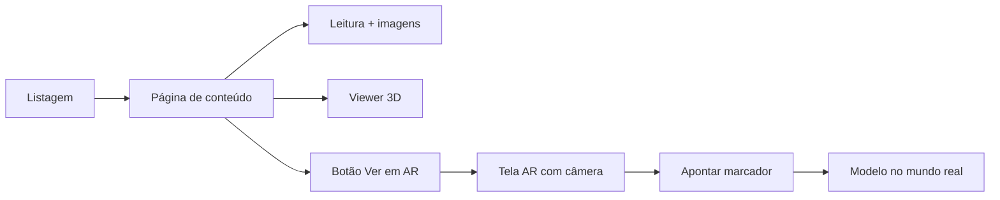

# Plano — Website de Conteúdo + Realidade Aumentada

Website para navegação e consumo de conteúdo editorial (texto, imagens, modelo 3D) e experiência de Realidade Aumentada, em que o usuário aponta a câmera para um marcador físico e visualiza o objeto no mundo real.

> Identidade visual e tokens de design: ver [`DESIGN.md`](./DESIGN.md).

---

## 1. Visão geral

| Módulo | Descrição |
|--------|-----------|
| **Conteúdo** | Páginas com texto rico, galeria de imagens e viewer 3D interativo |
| **AR** | Experiência em câmera: rastreamento de marcador + modelo sobreposto ao ambiente |
| **Admin (fase 2)** | CMS headless ou arquivos estáticos para publicar peças |

O projeto atual (`index.html` + AR.js) serve como **prova de conceito da camada AR**. O website completo será uma aplicação React moderna com HeroUI, reutilizando o aprendizado de marcadores (gerador oficial do [AR.js Marker Training](https://jeromeetienne.github.io/AR.js/three.js/examples/marker-training/examples/generator.html)).

---

## 2. Stack recomendada

| Camada | Tecnologia | Motivo |
|--------|------------|--------|
| Framework | **Next.js 15** (App Router) | SSR/SSG para conteúdo, rotas claras, deploy na Vercel |
| UI | **HeroUI v3** + Tailwind CSS v4 | Componentes acessíveis, theming via CSS variables |
| Tipografia | **Bebas Neue** (títulos) + sans-serif padrão HeroUI (corpo) | Ver `DESIGN.md` |
| Conteúdo | **MDX** ou **Contentlayer** | Texto + componentes embutidos (galeria, viewer 3D) |
| 3D (web) | **`<model-viewer>`** (Google) *ou* **React Three Fiber** + **drei** | Ver seção 4 |
| AR | **AR.js 3.4** + **A-Frame 1.3** *ou* **model-viewer** `ar` | Marcador customizado + GLB |
| Estado / dados | React Query (opcional) | Cache de assets pesados |
| Deploy | **Vercel** | HTTPS obrigatório para câmera e AR |

---

## 3. Arquitetura de rotas

```
/                          → Landing / listagem de peças ou exposição
/conteudo/[slug]           → Página editorial (texto, imagens, viewer 3D)
/conteudo/[slug]/ar        → Experiência AR da peça
/sobre                     → Institucional (museu, créditos)
```

### Fluxo do usuário



---

## 4. Modelo 3D (Blender → web)

### Limitação importante

Navegadores **não abrem arquivos `.blend` nativamente**. O pipeline correto é:

1. Modelar no **Blender**
2. Exportar como **glTF 2.0** (`.glb` recomendado — binário, um arquivo só)
3. Servir o `.glb` via CDN/Vercel
4. Exibir no viewer web e reutilizar o **mesmo `.glb`** na experiência AR

### Opção A — `<model-viewer>` (recomendada para MVP)

- Web component mantido pelo Google
- Rotação, zoom, pan, hotspots, animações glTF
- Modo AR nativo em Android (Scene Viewer) e iOS (Quick Look) via atributo `ar`
- Pouco código, boa performance em mobile

```html
<model-viewer
  src="/models/peca.glb"
  camera-controls
  touch-action="pan-y"
  auto-rotate
  shadow-intensity="1"
  ar
  ar-modes="webxr scene-viewer quick-look">
</model-viewer>
```

**Prós:** AR integrado, API simples, documentação sólida.  
**Contras:** Customização visual limitada; WebXR depende do dispositivo.

### Opção B — React Three Fiber + drei

- Controle total: iluminação, materiais, múltiplos objetos, anotações 3D
- `@react-three/drei`: `OrbitControls`, `Stage`, `Environment`, `Html` (labels)
- `@react-three/fiber`: render loop React-friendly

**Prós:** UI custom (controles, vistas preset, wireframe).  
**Contras:** Mais código; AR exige integração separada (AR.js ou WebXR manual).

### Opção C — Híbrida (recomendada para produção)

| Contexto | Solução |
|----------|---------|
| Página de conteúdo (desktop/mobile) | R3F + drei — viewer rico com vistas e legendas |
| Rota `/ar` | AR.js + A-Frame (como no POC) ou model-viewer `ar` |

### Funcionalidades do viewer 3D

- [ ] Orbit / zoom / pan
- [ ] Botões de vista preset (frontal, lateral, superior)
- [ ] Reset de câmera
- [ ] Toggle wireframe / texturas
- [ ] Loading progress (%)
- [ ] Fallback estático (imagem) se WebGL indisponível
- [ ] Lazy load do `.glb` (não bloquear a página)

---

## 5. Realidade Aumentada

### Abordagem principal: marcador (pattern)

Baseado no POC e no gerador oficial:

1. Imagem interna da peça ou logotipo do museu
2. Gerar `.patt` em [AR.js Marker Training](https://jeromeetienne.github.io/AR.js/three.js/examples/marker-training/examples/generator.html)
3. Baixar também a **imagem do marcador** (PDF/impressão para visitantes)
4. Configurar `a-marker type="pattern" url="..."` com o `.glb` como filho

### Abordagem complementar: AR sem marcador

- **model-viewer** `ar` — colocação em superfície plana (quando suportado)
- **WebXR Hit Test** — futuro; suporte ainda irregular no Safari iOS

### Requisitos técnicos AR

| Requisito | Detalhe |
|-----------|---------|
| HTTPS | Obrigatório (`getUserMedia`) |
| Permissões | `Permissions-Policy: camera=(self)` no `vercel.json` |
| Buffer | `preserveDrawingBuffer: true` se houver captura de foto |
| Marcador | Ratio 0,50, borda escura, imagem 512 px no gerador |
| Performance | GLB otimizado (< 5 MB ideal), texturas comprimidas (KTX2/Basis) |

### Fluxo AR na aplicação React

```
/conteudo/[slug]/ar
  ├── Overlay HeroUI (botão voltar, instruções)
  ├── Componente ARScene (A-Frame + AR.js carregados dinamicamente)
  ├── Marcador: patternUrl da peça
  └── Modelo: mesmo glb da página de conteúdo
```

Carregar A-Frame/AR.js **somente na rota AR** (code splitting) para não penalizar páginas de leitura.

---

## 6. Modelo de conteúdo

Cada peça (`slug`) contém:

```yaml
slug: suzane
title: "Suzane"
subtitle: "Peça do acervo"
cover: "/images/suzane/capa.jpg"
gallery:
  - "/images/suzane/01.jpg"
  - "/images/suzane/02.jpg"
body: |
  Texto em MDX...
model:
  src: "/models/suzane.glb"
  scale: [1.5, 1.5, 1.5]
  position: [0, 1.48, 0]
ar:
  markerPattern: "/markers/suzane.patt"
  markerImage: "/markers/suzane.png"
  markerSize: 1
```

Fonte dos dados (escolher uma):

- **Fase 1:** arquivos MDX + frontmatter no repositório
- **Fase 2:** Sanity / Strapi / Directus para edição pelo museu

---

## 7. Estrutura de pastas (proposta)

```
/
├── app/
│   ├── layout.tsx              # HeroUI + ThemeProvider + fontes
│   ├── page.tsx                # Home
│   ├── conteudo/
│   │   └── [slug]/
│   │       ├── page.tsx        # Conteúdo + viewer 3D
│   │       └── ar/
│   │           └── page.tsx    # Experiência AR
│   └── sobre/page.tsx
├── components/
│   ├── ui/                     # Wrappers HeroUI
│   ├── content/
│   │   ├── ArticleProse.tsx
│   │   ├── ImageGallery.tsx
│   │   └── ModelViewer3D.tsx
│   └── ar/
│       └── ARScene.tsx
├── content/
│   └── pecas/*.mdx
├── public/
│   ├── models/*.glb
│   ├── markers/*.patt
│   └── images/
├── styles/
│   ├── globals.css
│   └── theme-museu.css         # Tokens do DESIGN.md
├── DESIGN.md
└── PLAN.md
```

---

## 8. Fases de implementação

### Fase 1 — Fundação (1–2 semanas)

- [ ] Scaffold Next.js + HeroUI + tema custom (`DESIGN.md`)
- [ ] Layout responsivo (header, footer, navegação)
- [ ] Uma peça de exemplo em MDX (texto + imagens)
- [ ] Viewer 3D com `<model-viewer>` ou R3F

### Fase 2 — AR (1 semana)

- [ ] Rota `/conteudo/[slug]/ar`
- [ ] Port do POC AR.js para componente React
- [ ] Marcador gerado no treinador oficial
- [ ] Instruções on-screen (“Aponte para o marcador”)

### Fase 3 — Conteúdo e polish (1–2 semanas)

- [ ] Listagem de peças / busca
- [ ] Galeria de imagens (lightbox HeroUI)
- [ ] Otimização de assets (compressão GLB, next/image)
- [ ] SEO, Open Graph, acessibilidade (WCAG AA)
- [ ] PWA opcional (ícone, manifest)

### Fase 4 — CMS e operação (opcional)

- [ ] Integração headless CMS
- [ ] Pipeline Blender → export glTF automatizado
- [ ] Analytics (Vercel Analytics / Plausible)

---

## 9. Dependências principais

```json
{
  "@heroui/react": "latest",
  "@heroui/styles": "latest",
  "next": "15.x",
  "next-themes": "^0.4",
  "@google/model-viewer": "^4",
  "@react-three/fiber": "^9",
  "@react-three/drei": "^10",
  "three": "^0.17"
}
```

AR (carregamento dinâmico na rota `/ar`):

```html
<script src="https://aframe.io/releases/1.3.0/aframe.min.js"></script>
<script src="https://raw.githack.com/AR-js-org/AR.js/master/aframe/build/aframe-ar.js"></script>
```

---

## 10. Riscos e mitigações

| Risco | Mitigação |
|-------|-----------|
| AR instável em iOS Safari | Testar model-viewer Quick Look como fallback |
| GLB pesado em 3G | Draco compression, lazy load, poster image |
| Marcador não rastreia | Usar gerador oficial; borda preta; boa iluminação |
| `.blend` no repositório | Documentar export glTF; validar no CI |
| Permissão de câmera negada | UI clara + link para configurações |

---

## 11. Critérios de sucesso

- Usuário lê conteúdo e explora modelo 3D sem instalar app
- AR funciona em Android Chrome e iOS Safari (via marcador ou Quick Look)
- Visual alinhado à fachada rosa do museu (tema claro e escuro)
- Lighthouse Performance ≥ 80 em páginas de conteúdo (sem AR)
- Mesmo asset 3D serve viewer web e AR
